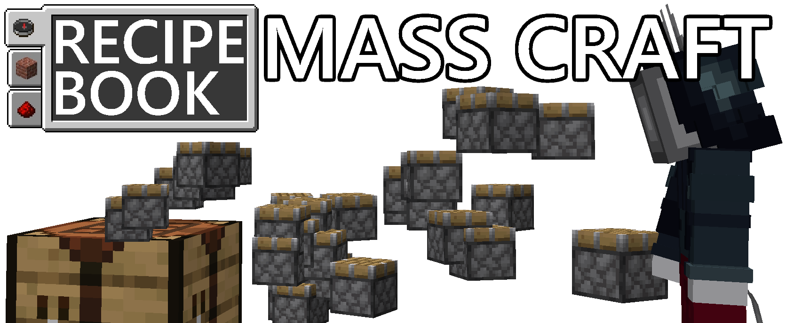

Adds the ability to use the built in recipe book for mass crafting in ItemScroller

## Showcase:

## Dependencies:
Needs [Itemscroller](https://www.curseforge.com/minecraft/mc-mods/item-scroller), [MaLiLib](https://www.curseforge.com/minecraft/mc-mods/malilib), and [Fabric API](https://modrinth.com/mod/fabric-api) \
Also works with the ports found on kosma.pl/masamods/ if you need Tweakeroo or Litematica as well

## Usage:
Click a recipe, press and hold the key combo bound to `recipeBookMassCraft`, which is `ctrl`+`q` by default

To change the key combo, press `I`+`C`, click `Hotkeys` and search for `recipeBookMassCraft`

## Note about this mod:
This mod was originally made by `boyenn#3717` in September 2021, released as a dev build in a few discord servers. He never worked on the mod further than this initial development.

I really liked the idea his mod implemented, so I decompiled it, translated the intermediary mappings to 1.19 Yarn mappings, and fixed a few bugs.

